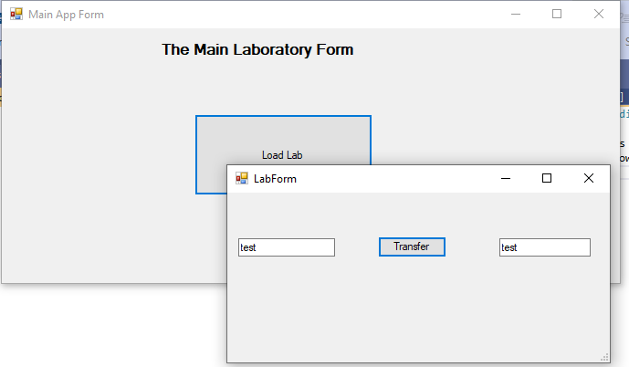

# Example win Forms application to Load a windows Form from a class library using Late Binding

This Solution shows how you can load a windows Form that is put in a class Library. It uses Late binding 
and the fact that the Windows Forms application already has a reference to the System.Windows.Forms namespace.  
The loaded form just copies a string from one textbox to another.  
